# DiVA Technical Network

DiVA technical network är en gemensam hub för DiVA-medlemmar i syfte att hantera skript, verktyg och program knutna till kommunikation mot DiVA:s nya API. Nätverket välkomnar alla användare som är intresserade av att delta i utvecklingen av dessa verktyg, oavsett om det är genom aktiv programmering eller deltagande i diskussioner. Målet är att samla utveckling och kunskapsutbyte till en gemensam plattform där varje deltagare kan påverka och förbättra verktygen.

Github-organisationen ägs av Uppsala universitet, men utvecklingen drivs gemensamt av aktiva medlemmar inom DiVA. För att underlätta utveckling och använding så har vi tagit fram ett antal riktlinjer.

De medlemmar som önskar att utveckla inom ramen av detta begär medlemsskap i DiVA technical network för att sedan skapa sina egna repon som de själva administrerar.

## Medlemskap, ansvar och underhåll av kod
Själva organisationens (DiVA technical network) medlemmar består primärt av användare som skapar sina egna repon. När en medlem skapar ett repo blir den även administratör för detta repo. Varje repos administratör ansvarar själv för sin kod, dess utveckling och att säkerställa att de är funktionella. 
Övriga användare som vill bidra begär medlemskap i dessa repon och det är upp till varje administratör att själva hantera medlemmar och dess rättigheter. Dessa läggs till som Collaborators.

```mermaid
graph TB
    subgraph Organization [**DiVA technical network**]
        subgraph OrgMembers [**Org-medlemmar**]
            Medlem1[Medlem 1]
            Medlem2[Medlem 2]
        end

        subgraph Repo2 [**Repo**]
            Admin2[Admin: Medlem 2]
            subgraph RepoMembers2 [**Repo-medlemmar**]
                repo2Maintain[Collaborator: maintain]
                repo2Write[Collaborator: write]
                repo2Read[Collaborator: read]
            end
        end

        subgraph Repo1 [**Repo**]
            Admin1[Admin: Medlem 1]
            subgraph RepoMembers1 [**Repo-medlemmar**]
                repo1Maintain[Collaborator: maintain]
                repo1Write[Collaborator: write]
                repo1Read[Collaborator: read]
            end
        end
        
        Medlem1 --> Admin1
        Admin1 --> RepoMembers1
        Medlem2 --> Admin2
        Admin2 --> RepoMembers2
    end

    style Organization fill:#444,stroke:#333,stroke-width:2px
    style OrgMembers fill:#888,stroke:#333,stroke-width:1px
    style Repo1 fill:#666,stroke:#333,stroke-width:4px
    style Repo2 fill:#666,stroke:#333,stroke-width:4px
    style RepoMembers1 fill:#888,stroke:#333,stroke-width:1px
    style RepoMembers2 fill:#888,stroke:#333,stroke-width:1px
```

Diagram av strukturen för organisation (DiVA technical network), medlemmar, repo och repo-medlemmar

## Repo
Repot förväntas att ha en main-branch där all kod ska vara stabil och körbar. All utveckling ska därför ske inom feature branches och endast merge'as efter att koden är inspekterad och godkänd av ansvarig ägare eller maintainers. På grund av detta är det önskvärt att det, där det finns möjlighet, även inkluderas tester för incheckad kod.

Riktlinjer för repo

* För att förenkla utveckling och användning förväntas varje verktyg att ha en tillhörande dokumentation eller **README**.
* Viktig information om verktyget ska vara med, så som specifika miljöinställningar, externa beroenden och fungerande exempel på hur verktyget används.
* Kodkvalité och kodstil bör upprättas enligt bestämda regler per verktyg och beroende av språk det utvecklas i (t.ex. pylint + PEP-8).
* För varje verktyg förväntas det även att finnas en tillhörande **CHANGELOG** för att enkelt följa utvecklingen och dess funktioner.
* Det är givetvis även viktigt att känslig data som lösenord, API-nycklar osv inte checkas in i repot. Detta betyder även att det skall finnas en uppdaterad .gitignore för att säkerställa att inga oönskade filer kommer med.

_Vid eventuella konflikter gällande kodkvalité eller design så skall dessa lösas av av repots ägare och/eller maintainers om sådana finns._

## Diskussionsyta
Diskussionsytan ska användas för att lyfta frågor och ärenden som är förknippat med utveckling av tekniska lösningar mot DiVA. Detta inkluderar exempelvis verktyg, integration och förslag på funktioner samt förbättringar av programvara.

Riktlinjer för diskussionsyta

* Skapa tydliga rubriker och innehåll som beskriver syfte och eventuell bakgrund till diskussionen.
* För att underlätta organisering och moderering ska kategorier och etiketter användas för varje diskussion.
* Moderering sker av ägare eller medlemmar av teamet Maintain.
* För eventuella buggrapporter ska Issues användas, inte diskussionsytan.

